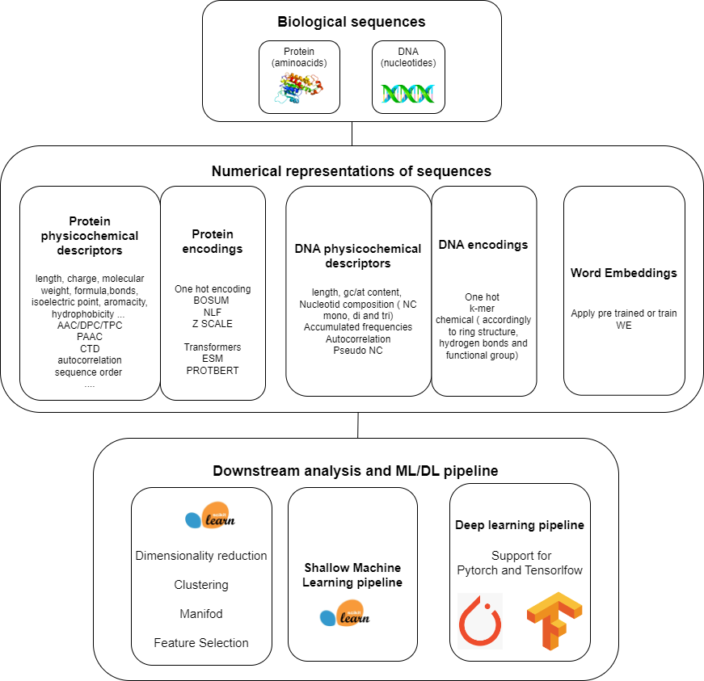
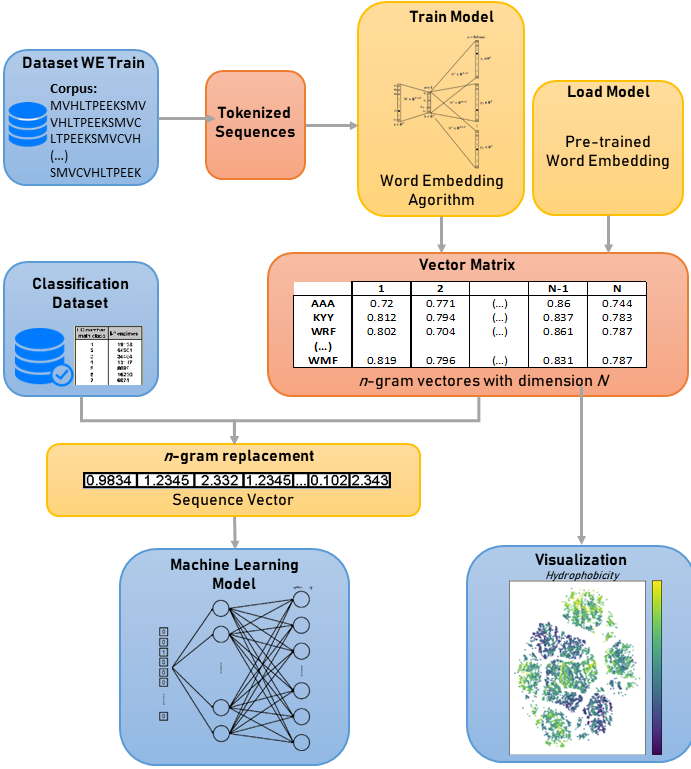

"# propythia3.0"
|License| |PyPI version| |RTD version|

ProPythia
============

*ProPythia* is a platform for the classification of biological sequences (proteins and DNA) using machine and deep learning.
It is a Python generic modular semi-automated platform containing functions for sequence representation and following ML/DL pipeline.
The main strength and use of this package is the DESCRIPTION of BIOLOGICAL SEQUENCES. A crutial step in any ML pipeline. 
It includes:
        - calculus of Protein physicochemical descriptors (parallelization available)
        - calculus of different protein encodings
        - calculus of DNA physicochemical descriptors
        - calculus of different DNA encodings
        - Train and use of Word Embedding techniques ( integration of Bumblebee - see Credits)

Besides, it also has functions to facilitate the major tasks of ML including feature selection and dimensionality reduction, visualization
of t-SNE and UMAP, perform clustering, train and optimize ML and DL models and make predictions with different algorithms,
for both classification and regression.

Due to its modular architecture, users can use only the description and apply to their own pipelines.

One can also use this code to an educational purpose as it is an introduction on how to perform ML and DL 
to classify biological sequences.

The code was tested on several case studies ( antimicrobial peptides, enzymes, subcellular location, DNA primers sequences and others) 
described both in the examples section and in the published papers (see Credits section).

General view: 

For Word embeddings module: 

Documentation
~~~~~~~~~~~~~
Documentation available at
~~~~~~~~~~~~~

Instalation from PyPI (stable releases)
~~~~~~~~~~~~~
pip install propythia
~~~~~~~~~~~~~~

Credits
~~~~~~~~~~~~~~
 If you find this repository useful in your work or for educational purposes please refer to one of these:

- Sequeira, A. M., Gomes, I., & Rocha, M. (2023).Word embeddings for protein sequence analysis. In 20th IEEE Conference
  on Computational Intelligence in Bioinformatics and Computational Biology (CIBCB2023) (pp. ). IEEE

- Sequeira, A. M., Lousa, D., & Rocha, M. (2022). ProPythia: a Python package for protein classification based on
  machine and deep learning. Neurocomputing, 484, 172-182.

- Sequeira A.M., Lousa D., Rocha M. (2021) ProPythia: A Python Automated Platform for the Classification of Proteins Using
  Machine Learning. Practical Applications of Computational Biology & Bioinformatics, 14th International Conference (PACBB 2020).
  PACBB 2020. Advances in Intelligent Systems and Computing, vol 1240. Springer, Cham. https://doi.org/10.1007/978-3-030-54568-0_4
~~~~~~~~~~~~~~~~~~~

License
~~~~~~~~~~~~~~~~~~~

Developed at the Centre of Biological Engineering, University of Minho

Released under the GNU Public License (version 3.0).

.. |License| image:: https://img.shields.io/badge/license-GPL%20v3.0-blue.svg
   :target: https://opensource.org/licenses/GPL-3.0
.. |PyPI version| image:: https://badge.fury.io/py/propythia.svg
   :target: https://badge.fury.io/py/propythia
.. |RTD version| image:: https://readthedocs.org/projects/propythia/badge/?version=latest&style=plastic
   :target: https://propythia.readthedocs.io/
